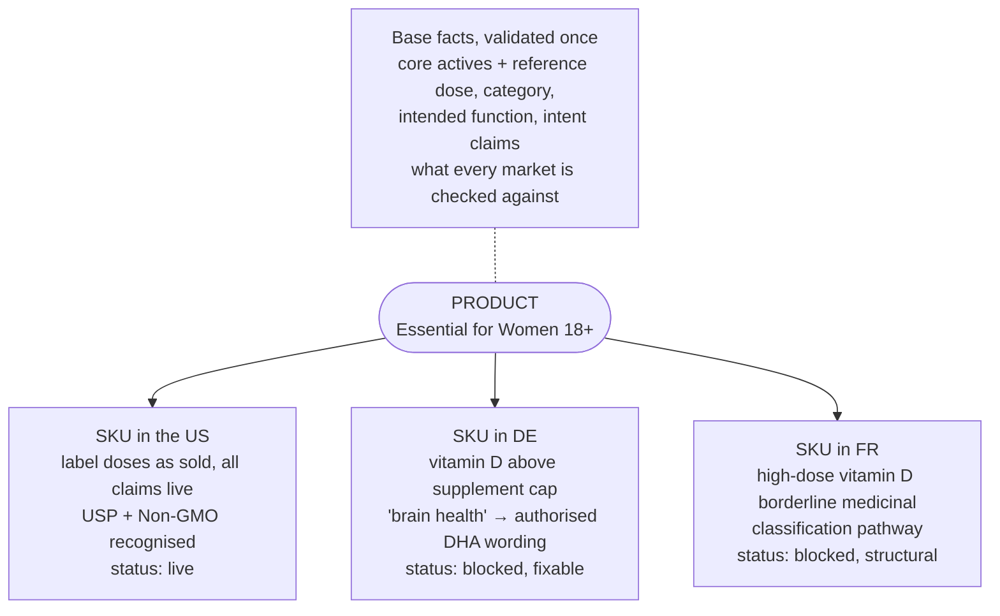
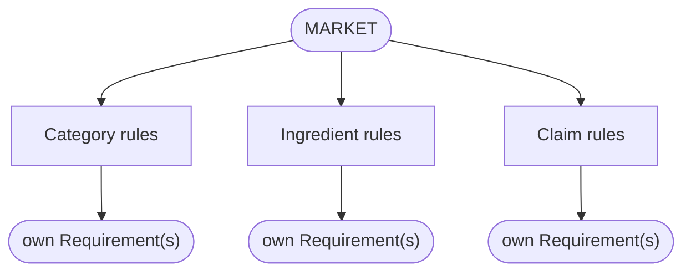
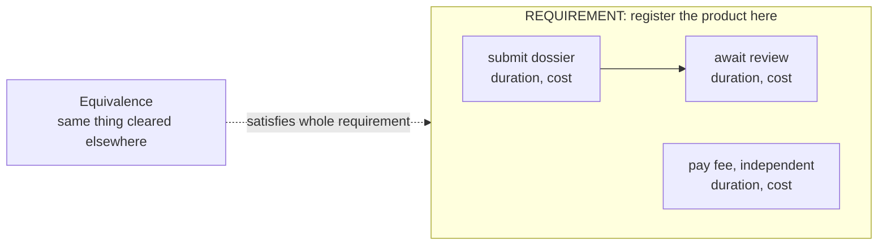
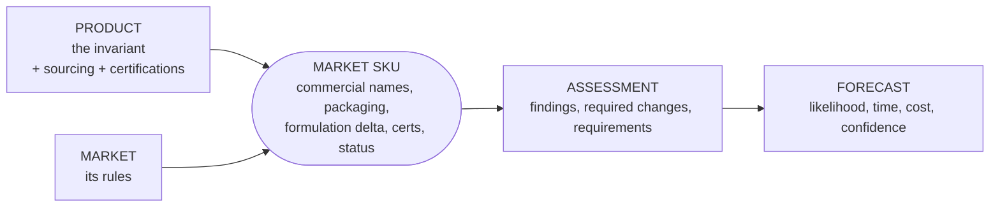
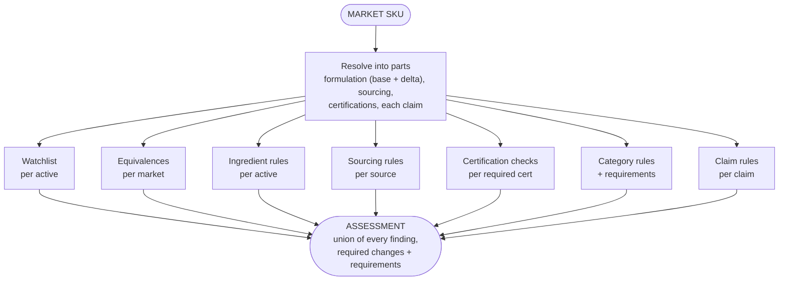
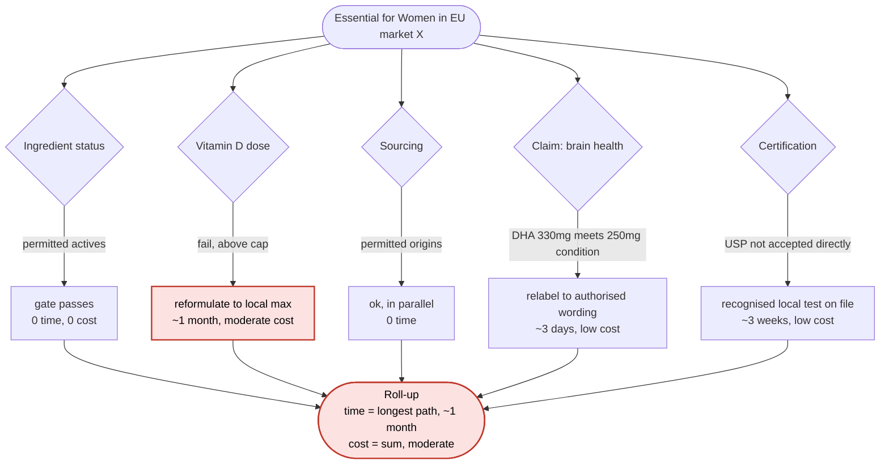
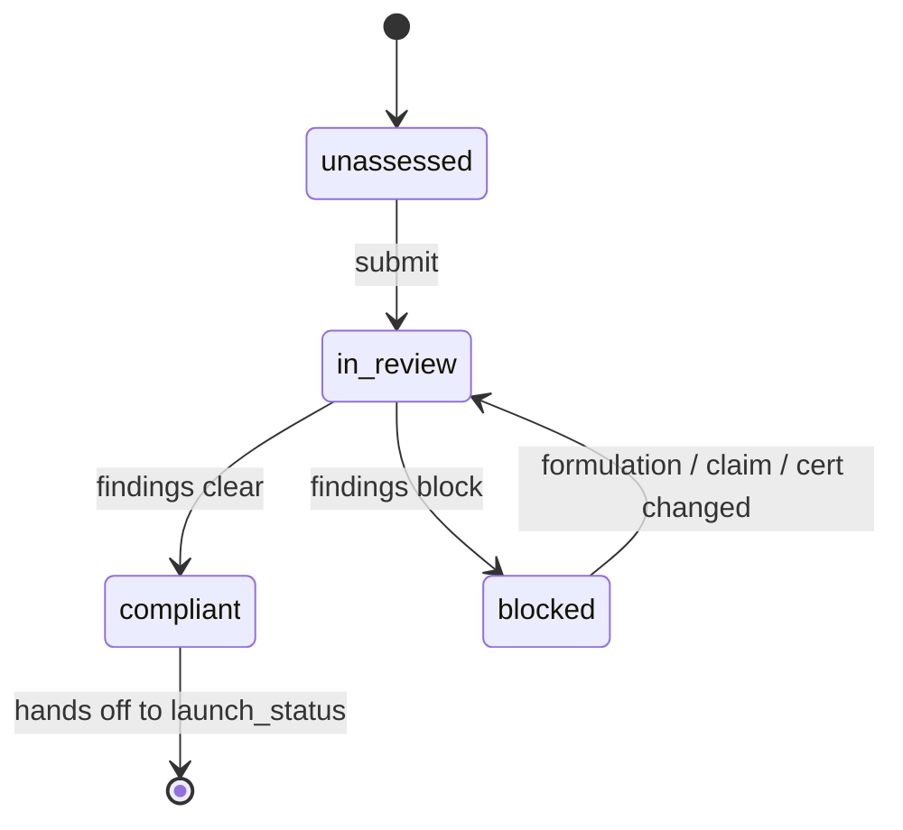
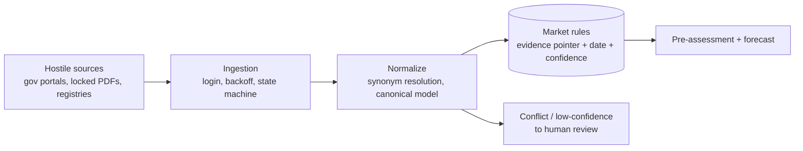
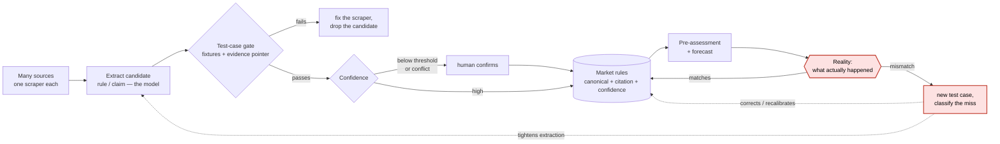

# SKU-level regulatory intelligence, a build sketch

This is how I would model products that must be represented differently in every market they sell in,
and answer the questions on top: how likely is this product to reach a market, how soon, at what cost,
what stands in the way. The hard part is not the dashboard, it is pinning down what the product actually
*is*, what stays invariant across markets and what each market is allowed to change.

Worked example throughout, **Ritual's Essential for Women 18+ multivitamin** (Product A in the brief):
one US product, a different verdict in every market it enters. Its nine actives each carry a dose some
EU markets cap below the US label, its "brain health" line must map to the EU authorised health-claim
register before it can be printed, and its US certifications (USP Verified, Non-GMO Project) do not
carry into the EU automatically. It is unusually good to model because Ritual publishes what most brands
hide, every ingredient's supplier and manufacturing location, its certifications, its testing, so the
sourcing dimension the dashboard tracks is, for once, real and public.

**At a glance** (the 3-minute version): a global `Product` validated once, one `MarketVariant`, the
market SKU, per market on top of it (section 1); a market's rules and requirements (section 2); a
deterministic pre-assessment of what blocks the SKU and why (section 4), feeding a `Forecast` of
likelihood, time and cost read off a dependency graph (section 5); a product x market dashboard over it
(section 7); and underneath, the ingestion and trust loop that fills the model from hostile sources and
corrects itself against reality (sections 8 to 10).

> **Scope.** Illustrative engineering model, not regulatory advice. The ingredient, sourcing and
> certification facts are Ritual's real published data; the regulatory outcomes, timelines and costs
> are placeholders to show the shape. The focus is the data modelling, traceability and product
> workflow, not domain expertise, which I do not claim.

---

## 1. The concept

One product, one representation per market, an invariant core you validate once. That core, the
**`Product`**, is what the thing fundamentally is: its category, intended function, active ingredients
with their reference doses, where each is sourced, the certifications it holds, the claims it intends to
make. It does not change when you cross a border. What changes is the representation: in each market the
product becomes a **`MarketVariant`**, the sellable unit, the **SKU**, as it exists there, with its own
commercial name, dose and packaging, the claims it is actually allowed to make, the certifications that
market recognises, and a status in the launch process.

The base is the source of truth twice over, for identity and for validation: its reference dose is what
a market's cap is checked against, its intent claims are what a market's rules rule on. It propagates
when it changes; each SKU carries only what is local to its market. Everything after this is machinery:
a market's rules (section 2), how a SKU is evaluated (sections 3 to 5), where the data comes from
(section 8).

One note on identity, narrower than it looks. The product and the rules do not speak the same language:
a label says "vitamin D3", a formulation sheet "cholecalciferol", one authority keys it by CAS, another
by an FDA UNII, a national register by a local name. Applying the right rule to the right ingredient
means resolving that these are one substance, synonym resolution of nomenclature: strong key first
where a jurisdiction-specific identifier exists (CAS, UNII, a register code), a curated synonym map,
fuzzy fallback only when there is no strong key so it never overrides a certain match. Smaller than the
dirty-catalog deduplication I did in production (section 8), same discipline: trust the strong key,
never let the fuzzy layer overrule it.

---

## 2. The market: what it requires

The product view says what the thing is. This view says what a market allows, keyed by **market plus
product category**, because the rules a supplement follows are not the rules a cosmetic follows. A
market defines three kinds of rule:

- **`CategoryRule`** what a whole category must satisfy here.
- **`IngredientRule`** status (allowed, restricted, prohibited, prescription-only) and max dose, per
  ingredient.
- **`ClaimRule`** whether a claim is allowed, prohibited or conditional, mapped to the register (for
  the EU, the 1924/2006 authorised list).

Any of the three can impose a **`Requirement`**: something you have to do before you can publish. Not
just categories, an ingredient can require a filing, a claim can require substantiation.

Every rule carries its own **evidence pointer** (a source snapshot with the quote or table cell, URL,
date) and a **confidence**, because these are extracted from messy sources and we are rarely fully
certain. A rule with no citation does not exist (section 9). And a **`RegulatedSubstance`** watchlist
sits across everything: ingredients heavily regulated anywhere, flagged before any rule runs.

### Requirements are composed, not atomic

A requirement is not one action but a small graph of **steps**, each with an estimated duration, cost
and its **dependencies**, because some run in parallel and some cannot. That structure is what the
forecast in section 5 walks. And a **`MarketEquivalence`** can satisfy a requirement outright: if the
same thing is already cleared in an equivalent market, the requirement is skipped and the source
clearance recorded.

---

## 3. The fit: product meets market

This is where a `Product` becomes real in a `Market`. The **`MarketVariant`**, the market SKU, layers
on the market's reality: commercial names, packagings (dose plus format), a formulation delta versus
the base, market-specific claims and attributes, the certifications that market accepts, an
implementation status. The base is truth for identity; the SKU is where a market's specifics and its
go-to-market state live. A change to the base propagates; a change in one market stays local.

Two base facts are first-class because the brief tracks them and they drive real findings.
**Sourcing**: each active is an `IngredientSource`, a `Supplier` plus a `ManufacturingFacility` with a
country, so Ritual's vitamin D3 from Nottingham and its folate from Pisticci are distinct, queryable
facts, not a note in a cell. **Certifications**: each a `Certification` with an issuer and scope (USP
Verified, Non-GMO Project, B Corp). Both are **versioned** (`FormulationVersion`, `PackagingVersion`),
so when a supplier or dose changes the old assessment does not silently go wrong, it is re-run against
the version that changed. Neither is decoration: a market can require a certification it recognises (a
`Requirement`), and an ingredient's origin can decide whether it counts as a novel food or carries an
import restriction.

The SKU is then **evaluated**: a pre-assessment produces an assessment, which feeds a forecast (sections
4 and 5, the point of the whole thing).

---

## 4. The pre-assessment service

Given a `MarketVariant`, it works out what blocks the product there. It reads rules, it does not ask a
model for the answer, so the same inputs give the same findings, each carrying the confidence of the
rule behind it rather than faking certainty.

Fan-out then fan-in: it resolves the SKU into its parts (formulation base plus delta, sourcing,
certifications, each claim), then runs every check independently, usually several of each, one per
ingredient, per source, per claim, per applicable equivalence:

- **watchlist**: is any active a `RegulatedSubstance`, flagged before anything else
- **equivalences**: is any part already cleared in an equivalent market
- **ingredient rules**: each active against this market's dose limits and permitted-substance list
- **sourcing**: each `IngredientSource` against origin restrictions and novel-food status
- **certifications**: the certs this market requires, and whether the SKU already holds an accepted one
- **category rules**: the category's requirements here
- **claim rules**: each claim against the authorised register

The **`Assessment`** is the union of all of it: every finding with its rule and citation, the required
changes, and the requirements to clear them. It is the sum of the parts, not a single verdict handed down.

---

## 5. The forecast, the part that matters most

We can almost never say "yes, certainly". What a brand can actually plan against is an estimate: **how
likely this product is to reach the market, how long it takes, what it costs, and how much to trust
the number.** That is the forecast, and it is built on the assessment, not guessed.

Each blocking finding is a stopper, and a stopper is not a flag, it carries three things: whether it
is **fixable or structural**, its **estimated time**, and its **estimated cost**. This is why the
count of stoppers tells you almost nothing on its own. Three small fixable stoppers can be faster and
cheaper than one structural one.

**Where the estimate comes from: the dependency graph.** The steps that make up a market's
requirements are not a flat list, they form a graph: each node is a step with a duration and a cost,
each edge is a `depends_on`. From that one structure both numbers fall out, and they fall out differently:

- **Time is the critical path**, the longest weighted chain to launch. Anything off it runs in
  parallel, free on the clock: five steps sequential is months, run in parallel it is the longest one.
- **Cost is the sum**: you pay every node whether or not it sits on the critical path. This is exactly
  why "three cheap stoppers" and "one expensive stopper" can invert.
- **Parallelism is read from the graph, not hand-drawn**: any step whose dependencies are met can start
  now, so the estimate updates itself when a rule changes.

Walk Essential for Women into an EU market to see it. Each check is a gate. A gate that passes costs
nothing; a gate that fails spawns a requirement with its own steps, time and cost; independent gates
run side by side. Some gates offer more than one way through, and the forecast takes the cheapest
viable path.

- **Ingredient status**: the vitamins and the algal DHA are permitted actives here. Gate passes, no
  time, no cost.
- **Dosage, vitamin D**: fails, 2000 IU is above this market's supplement cap. Requirement: reformulate
  to the local maximum, or file for the higher dose. About a month, moderate cost.
- **Sourcing**: every `IngredientSource` is a permitted origin, no novel-food flag. Passes in parallel,
  free.
- **Claim, "brain health"**: the brand wording is not printable, but the substance clears. The EU
  register authorises "DHA contributes to the maintenance of normal brain function" conditional on
  250mg of DHA a day, and the SKU carries 330mg, so the condition is met. Requirement: relabel to the
  authorised wording. Days, low cost.
- **Certification**: the market does not accept USP Verified directly. An equivalence covers the
  substance testing, but it still wants a recognised local test on file. Three weeks, low cost.

Sum it right. **Time is the longest path, not the total**: the ~1-month reformulation dominates, and
the 3-day relabel, 3-week filing and free sourcing check all fit inside it. **Cost is the total**:
reformulation plus small filings, moderate. So the estimate is **conditional, about a month, moderate
cost**, and it moves the moment a rule, duration or chosen option changes. Contrast France, where the
one stopper is structural: at 2000 IU the vitamin D dose pushes toward a borderline-medicinal
classification, a single finding but months and high cost, and the read flips to **unlikely**. One
blocker can outweigh five, and only the time-as-longest-path plus cost-as-sum view shows it.

The `Forecast` per SKU, then:

- **`likelihood`** `likely` / `uncertain` / `unlikely`. Structural stoppers with no reasonable fix
  push it down; fixable ones keep it up.
- **`est_time_to_market`** a range from the critical path over remaining blocking steps, shortened by
  equivalences.
- **`est_cost`** the summed cost of the required changes and steps.
- **`confidence`** how much to trust all of the above. If the underlying rules were extracted with low
  confidence or two sources conflicted, the forecast says so instead of faking precision.

---

## 6. The status lifecycle

A SKU carries **two** statuses, because "does it clear the rules" and "is it on sale" are different
questions and conflating them hides state. Both are first-class; the first is driven by the assessment,
not set by hand, the second by the go-to-market work and only meaningful once the first is `compliant`.

**`regulatory_status`**, the assessment's verdict:

| status | meaning |
|---|---|
| `unassessed` | defined, not yet assessed |
| `in_review` | pre-assessment running or awaiting a decision |
| `compliant` | clears the rules as they stand |
| `blocked` | a rule blocks it, carries the required changes and steps to unblock |

**`launch_status`**, where the SKU is in going to market:

| status | meaning |
|---|---|
| `draft` | not yet worked |
| `ready` | listing prepared |
| `listed` | published, not yet selling |
| `live` | on sale |

---

## 7. The dashboard views

1. **Product x Market matrix (hero).** Rows are markets, a heatmap on status, with likelihood, time
   and cost per cell, and the top stopper. Click through to the findings and their citations. The
   Golden SKU in one screen.

   | Market | Reg. status | Likelihood | Est. time | Est. cost | Top stopper |
   |---|---|---|---|---|---|
   | US | live | shipped | shipped | shipped | none |
   | DE | blocked | likely | ~1 month | moderate | vitamin D over supplement cap (2 fixable, parallel) |
   | UK | in_review | likely | ~3 weeks | low | "brain health" needs authorised DHA wording |
   | FR | blocked | unlikely | months | high | high-dose vitamin D borderline medicinal |

2. **Per-market detail.** For one SKU: every ingredient, source and claim, the rule, the evidence
   behind it (snapshot plus date), the required change, and the requirement steps with durations, costs
   and dependencies.
3. **Sourcing map.** The SKU's ingredients by supplier and manufacturing country, with any origin or
   certification finding attached, Ritual's real six-country supply chain as the worked case.
4. **Roadmap / sequencing.** Products and markets ordered by likelihood, time and cost: what ships
   first, what needs work, what to drop.
5. **Claims tracker.** Per claim, which markets accept it and under what condition, mapped to the
   authorised register.
6. **What-if.** Change a dose, swap a supplier or drop a claim, re-run pre-assessment and forecast, see
   which markets open and how the timeline and cost move.
7. **Change monitor.** Regulatory changes over time: a diff plus which SKUs it re-opens.

---

## 8. The ingestion spine, because the model is only as good as what fills it

The rules and requirements do not appear by hand. They come from hostile sources: government portals,
locked PDFs, legal databases, national registers, each publishing differently and changing without
warning. This is the part I have built in production, on a different domain.

A multi-supplier sync engine ingesting 7 heterogeneous catalogs behind one pipeline: login-gated
scraping with persisted cookies and browser-like headers, CSV drops, batched HTTP feeds, all driven
by a cron state machine that survives real volume (timeout and out-of-memory guards that split the
work across runs, exponential backoff from hours to weeks). Everything normalized to a canonical model
with a strong key first (EAN) and a fuzzy fallback only when there is no strong key.

The same shape is public and browsable in my board-game RAG project (repo below): heterogeneous sources
behind one `fetch -> canonical doc` contract, incremental re-ingest keyed on a content hash so unchanged
records are skipped, everything normalized to a canonical model in a durable store. No login walls, so
it is the *methodology* laid bare rather than the hostile-source hardening, but unlike the production
system it is code you can read. Same skeleton, two domains: the sources change, the shape does not.

---

## 9. Trust, because in a regulated product it is the feature

Wrong data here has real-world consequences, so the principle is: **keep deterministic everything that
can be, let the model add signal without ever letting it decide, never claim a certainty we do not
have.** I explored and measured this exact separation in an unpaid retrieval project (repo below),
different domain, but where I work out how to make an LLM's output trustworthy. The patterns I carry
over:

- **The model structures, the code decides.** Parsing a legal PDF into a candidate rule, mapping a
  free-text claim to a register entry: that is extraction, an LLM is good at it. The finding is not.
  The pre-assessment computes from stored rules, not from model prose.
- **Every derived fact keeps an evidence pointer or it gets dropped.** A source snapshot, the page, the
  exact quote or table cell, and a document hash so it survives the source changing under it. The quote
  or cell must actually appear in the snapshot, the same anti-fabrication check I run in that project,
  but the pointer covers the tables and scanned PDFs a bare quote does not.
- **Certain data always wins.** A value from an authority's own published ruleset beats an extraction.
- **Uncertainty is carried, not hidden.** Rules keep a confidence, conflicting or low-confidence
  sources are routed to human review before they touch a decision, and the forecast reports the weaker
  confidence rather than faking precision. I do the same in a production tax-reconciliation flow: when
  the parts do not add up to the total, the row is marked for manual review instead of silently
  corrupting the result.

Those are the principles at rest. Section 10 is what they look like running: the loop that feeds the
machine and lets reality correct it over time.

---

## 10. Feeding the machine

Sections 8 and 9 are two halves of one loop, and the loop is the product. The model is never trained
once and trusted; it is **fed continuously and corrected against reality every time it is wrong.** End
to end it is a cycle, not a pipeline:

- **Many sources, many scrapers, one contract.** A portal, a locked PDF and a national register are
  read three different ways but land the same shape: a candidate rule with its evidence pointer. The
  mess stays in the scraper; downstream sees the canonical model (section 8). Format reaches into
  extraction too, a register export, an HTML table and prose in a PDF do not respond to the same prompt,
  so each source carries an **extraction prompt tuned to its format**, not one generic prompt fighting
  every layout.
- **Extraction is the model's job, admission is not.** An LLM turns a page of legal prose into a
  candidate `ClaimRule` or `IngredientRule`. That candidate is not yet a fact. It has to clear the gate.
- **Every extractor is pinned by test cases.** A scraper ships with fixtures: known inputs whose
  correct extraction is written down. Change the extractor and the fixtures must still pass; a source
  changes its layout and a fixture goes red, and that is the signal to fix the scraper, not a silent
  drift into wrong data. The evidence-pointer check runs here too, a rule whose quote or table cell
  does not actually appear in the stored snapshot is dropped, never admitted.
- **Confidence is graded, not assumed.** Each admitted rule carries a confidence from how it was
  obtained: an authority's own published ruleset is high, a fuzzy extraction from an ambiguous PDF is
  low, two sources that disagree are flagged.
- **Below a threshold, a human confirms before it counts.** High-confidence rules flow straight in;
  anything under the line (low confidence or a conflict) is queued for manual confirmation and cannot
  touch a forecast until a person signs it off. And the line is **per source, not one global bar**: a
  national authority earns a threshold a scraped aggregator never does, so the same confidence number
  auto-admits from one and waits for a human from another. Where each line sits is a dial, a liability
  decision (below), not a technical one.
- **Then it serves** the pre-assessment and forecast (sections 4 and 5), each finding still carrying
  the confidence of the rule behind it.

And the part that makes it a machine, not a pipeline: **the forecast is a prediction, so reality gets
to grade it.** When a launch actually happens, clears in three weeks instead of three months, hits a
procedure nobody modelled, or a blocked claim sails through, that outcome is compared against what the
forecast said. A match is a quiet confirmation; a mismatch becomes a **test case**. Was a rule missing,
one extracted wrong, a duration off, the procedure different from the modelled one, the miss is
classified and written down as a case the system must henceforth get right. Extraction tightens, a rule
is corrected or its confidence adjusted, and the next prediction of that shape lands closer to reality.

That is the whole point: quality only ratchets one way, because **every time the world disagrees with
the model, the disagreement becomes a permanent test** it has to keep passing. Nothing wrong once is
allowed to be silently wrong again. Same discipline as the kept regression in the retrieval project
(section 9): a real miss, pinned red, kept as a green guard once fixed, here on regulatory predictions
instead of search ranks.

---

## Proof I build

- The ingestion and canonical-model work in section 8 (login-gated scraping, EAN plus fuzzy
  normalization, cron state machine) is production client code (private), described from the real
  system. It is the closest match to this kind of hostile-source ingestion problem.
- The trust, grounding **and ingestion methodology**: `github.com/msporchia/board-game-rag-seller`
  (Python, LangGraph, Qdrant). An unpaid side project, not in production, but the grounding, the
  pluggable-source-to-canonical-model ingestion with incremental content-hash re-ingest, and the
  three-level eval harness are all real and browsable. It is where I show how I explore a problem, not
  a shipped product.

These two sit at **different bars, because the stake of a wrong answer differs.** Recommend the wrong
board game and a customer is mildly let down; admit a wrong regulatory rule and a non-compliant product
reaches a shelf. So rigor is proportioned to the cost of being wrong: the board-game project is where
the machinery (grounding gates, frozen rulers, kept regressions) could be explored cheaply because the
downside was low; the production ingestion is where a real cost of error forced the strong-key-first
discipline and the manual-review fallback. Reading the stake and spending exactly the rigor it warrants,
no more, is the skill on offer, and a regulated product sits at the high end where the bar is
unforgiving.
