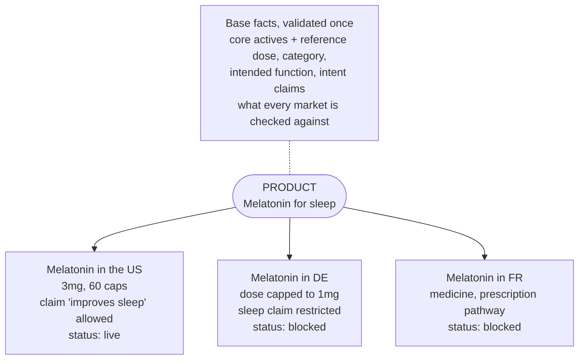
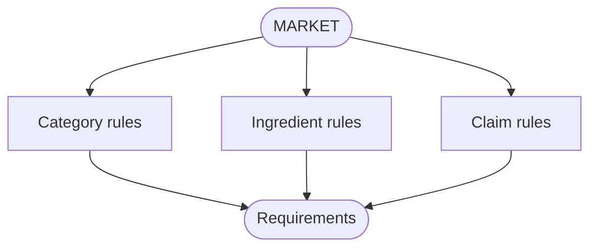
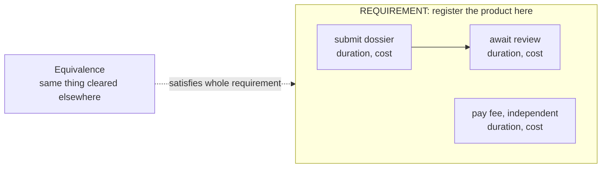
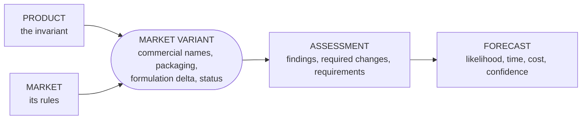
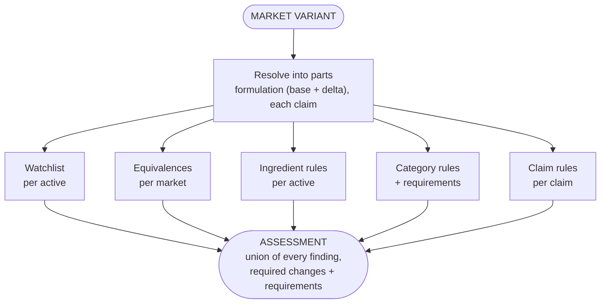
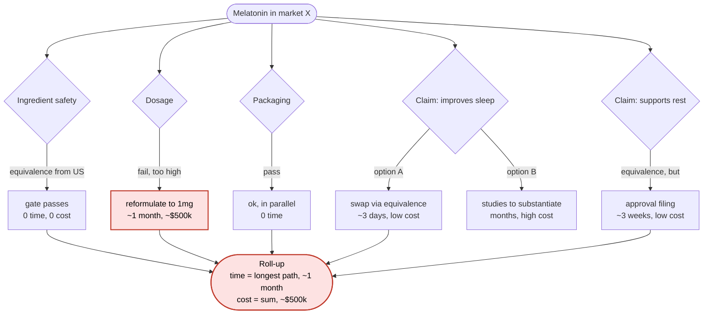
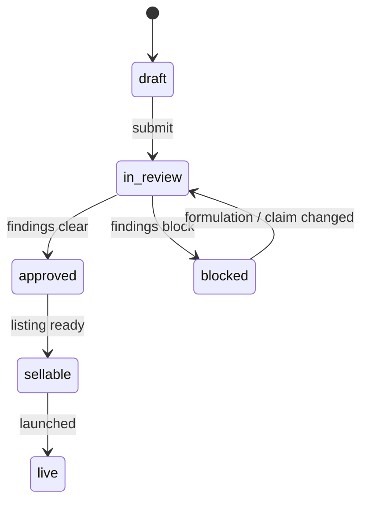
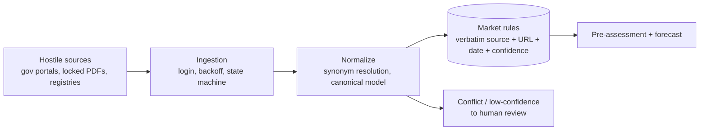
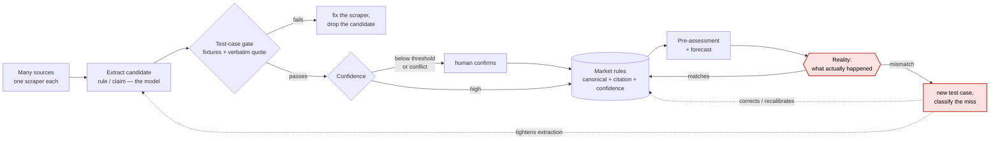

# SKU-level regulatory intelligence, a build sketch

This is how I would model and manage products that have to be represented differently in every market
they sell in, and answer the questions that matter on top of it: how likely is this product to reach
that market, how soon, at what cost, and what stands in the way. The hard part is not the dashboard,
it is knowing what the product actually *is*: pinning down what stays invariant across markets, and
what each market is allowed to change.

Worked example throughout, a **melatonin sleep supplement**: one product, a different verdict in every
country. In the US it is an over-the-counter supplement, in much of the EU it is a medicine or capped
to a low dose, and the claim "improves sleep" clears in the US but falls under the EU Health Claims
Regulation. Same molecule, three different market entries. Get the model right and that becomes
legible instead of a spreadsheet nobody trusts.

> **A note on scope.** I have no background in regulatory affairs, and this is not regulatory advice.
> It is a hypothetical: how I would reason about and structure the problem as an engineer. The
> processes, timelines, costs and procedures in the examples are made up to illustrate the shape, not
> researched, and real requirements would change the structure significantly. What is on offer here is
> the modelling and the reasoning, not domain knowledge.

I start from the concept (section 1), then fill it in: what each market requires, how a product and a
market fit, and the forecast that sits on top.

---

## 1. The concept

One product, one representation per market, and an invariant core underneath that you validate once.
That core, the **`Product`**, is what the thing fundamentally is: its category, its intended function,
its core active ingredients with a reference dose, the claims it intends to make. It does not change
when you cross a border. What changes is the representation: in each market the product becomes a
**`MarketVariant`** with its own commercial name, its own dose and packaging, the claims it is
actually allowed to make there, and a status in the launch process.

That is the whole idea. The base is the source of truth twice over: for identity, and for validation.
Its reference dose is what a market's dose cap is checked against; its intent claims are what a
market's claim rules rule on. It propagates when it changes; each variant carries only what is local
to its market. Everything after this is machinery around it:
the rules a market imposes (section 2), how a variant is evaluated against them (sections 3 to 5), and
where the data comes from (section 8).

One note on identity, because it is narrower than it looks. The product and the rules do not speak the
same language: a formulation says "melatonin", an FDA rule says "melatonin", an EU register lists it
by INCI name or E-number, a national source may use the chemical name. To apply the right rule to the
right ingredient you have to resolve that these are one substance. That is synonym resolution of
nomenclature (strong key first via INCI / E-number, fuzzy fallback only when there is no strong key,
so it never overrides a certain match), not the deduplication of dirty supplier catalogs. It is a
smaller problem than the catalog matching I did in production (section 8), but the same discipline:
trust the strong key, never let the fuzzy layer overrule it.

---

## 2. The market: what it requires

The product view says what the thing is. This view says what a market allows, keyed by **market plus
product category**, because the rules a supplement follows are not the rules a cosmetic follows. A
market defines three kinds of rule:

- **`CategoryRule`** what a whole category must satisfy here.
- **`IngredientRule`** status (allowed, restricted, prohibited, prescription-only) and max dose, per
  ingredient.
- **`ClaimRule`** whether a claim is allowed, prohibited or conditional, mapped to the register (for
  the EU, the 1924/2006 authorised list).

Any of the three can impose a **`Requirement`**: something you have to do before you can publish. Not
just categories, an ingredient can require a filing, a claim can require substantiation.

Every rule also carries its own **verbatim source quote plus URL plus date** and a **confidence**,
because these are extracted from messy sources and we are almost never fully certain. A rule with no
citation does not exist (section 9). And a **`RegulatedSubstance`** watchlist sits across everything:
ingredients heavily regulated anywhere, flagged before any rule runs. Know your landmines.

### Requirements are composed, not atomic

A requirement is not one action, it is a small graph of **steps**, each with an estimated duration and
cost and its **dependencies**, because some run in parallel and some cannot. That structure is exactly
what the forecast in section 5 walks to turn a pile of obligations into a real timeline. And a
**`MarketEquivalence`** can satisfy a requirement outright: if the same thing is already cleared in an
equivalent market, the whole requirement is skipped and the source clearance recorded.

---

## 3. The fit: product meets market

This is where a `Product` becomes real in a `Market`. The **`MarketVariant`** references the base and
layers on the market's reality: commercial names, packagings (dose plus format), a formulation delta
versus the base, market-fit attributes, and an implementation status. The base is the source of truth
for identity; the variant is where a market's specifics and its go-to-market state live. A change to
the base propagates; a change in one market stays local.

The variant is then **evaluated**: a pre-assessment produces an assessment, which feeds a forecast.
Those two (sections 4 and 5) are the point of the whole thing.

---

## 4. The pre-assessment service

Given a `MarketVariant`, it works out what blocks the product in that market. It reads rules, it does
not ask a model for the answer, so the same inputs give the same findings, and each finding carries
the confidence of the rule behind it rather than pretending to certainty.

The shape is fan-out then fan-in. First it resolves the variant into its parts: the real formulation
(base plus delta) and each claim. Then every check runs independently, and there are usually several
of each, one per ingredient, one per claim, one per applicable equivalence:

- **watchlist**: is any active a `RegulatedSubstance`, flagged before anything else
- **equivalences**: is any part already cleared in an equivalent market
- **ingredient rules**: each active against this market's limits
- **category rules**: the category's requirements here
- **claim rules**: each claim against the register

The **`Assessment`** is the union of all of it: every finding with its rule and citation, the required
changes, and the requirements to clear them. It is the sum of the parts, not a single verdict handed down.

---

## 5. The forecast, the part that matters most

We can almost never say "yes, certainly". What a brand can actually plan against is an estimate: **how
likely this product is to reach the market, how long it takes, what it costs, and how much to trust
the number.** That is the forecast, and it is built on the assessment, not guessed.

Each blocking finding is a stopper, and a stopper is not a flag, it carries three things: whether it
is **fixable or structural**, its **estimated time**, and its **estimated cost**. This is why the
count of stoppers tells you almost nothing on its own. Three small fixable stoppers can be faster and
cheaper than one structural one.

**Where the estimate comes from: the dependency graph.** The steps that make up a market's
requirements are not a flat list, they form a graph: each node is a step with a duration and a cost,
each edge is a `depends_on`. From that one structure both numbers fall out, and they fall out differently:

- **Time is the critical path.** The longest weighted chain from start to launch. Anything not on that
  chain runs in parallel and is free on the clock. Line five independent steps up sequentially and it
  is months; let the graph run them in parallel and it is the length of the longest one.
- **Cost is the sum.** You pay for every node whether or not it sits on the critical path, so cost
  adds up across the whole graph while time does not. This is exactly why "three cheap stoppers" and
  "one expensive stopper" can invert: few resources, short path.
- **Parallelism is read from the graph, not hand-drawn.** Any step whose dependencies are met can
  start now. The structure decides what overlaps, so the estimate updates itself when a rule changes.

Walk melatonin through a market to see it. Each check is a gate. A gate that passes costs nothing; a
gate that fails spawns a requirement with its own steps, time and cost; independent gates run side by
side. Some gates offer more than one way through, and the forecast takes the cheapest viable path.

- **Ingredient safety**: an equivalence from the US covers it. Gate passes, no time, no cost.
- **Dosage**: fails, the dose is above the cap. Requirement: reformulate to 1mg. About one month, ~$500k.
- **Packaging**: passes, runs alongside for free.
- **Claim, improves sleep**: not on the register, but two ways through. Option A, swap to an equivalent
  claim already cleared elsewhere (days, cheap). Option B, run studies to substantiate it (months,
  expensive). The forecast takes A and keeps B as the fallback.
- **Claim, supports rest**: an equivalence covers the substance, but the market still requires an
  approval filing. Three weeks, low cost.

Now sum it the right way. **Time is the longest path, not the total.** The reformulation at one month
dominates; the 3-day claim swap, the 3-week filing and the free packaging check all fit inside that
month, so time-to-market is about a month, not the sum of every step. **Cost is the total**: the ~$500k
reformulation plus the small filings. The real estimate is **conditional, about a month, ~$500k**, and
it moves the moment a rule, a duration or a chosen option changes. Contrast a market where the one
stopper is structural, a medicine classification needing a prescription pathway: a single finding, but
months and high cost, and the read flips to **unlikely**. One blocker can outweigh five, and only the
time-as-longest-path plus cost-as-sum view shows it.

The `Forecast` per variant, then:

- **`likelihood`** `likely` / `uncertain` / `unlikely`. Structural stoppers with no reasonable fix
  push it down; fixable ones keep it up.
- **`est_time_to_market`** a range from the critical path over remaining blocking steps, shortened by
  equivalences.
- **`est_cost`** the summed cost of the required changes and steps.
- **`confidence`** how much to trust all of the above. If the underlying rules were extracted with low
  confidence or two sources conflicted, the forecast says so instead of faking precision.

---

## 6. The status lifecycle

The variant's `status` is a first-class field driven by the assessment, not set by hand.

| status | meaning |
|---|---|
| `draft` | defined, not yet assessed |
| `in_review` | pre-assessment running or awaiting a decision |
| `approved` | clears the rules, cleared to prepare |
| `sellable` | approved and the listing is ready |
| `live` | on sale |
| `blocked` | a rule blocks it, carries the required changes and steps to unblock |

---

## 7. The dashboard views

1. **Product x Market matrix (hero).** Rows are markets, a heatmap on status, with likelihood, time
   and cost per cell, and the top stopper. Click through to the findings and their citations. The
   Golden SKU in one screen.

   | Market | Status | Likelihood | Est. time | Est. cost | Top stopper |
   |---|---|---|---|---|---|
   | US | live | shipped | shipped | shipped | none |
   | DE | blocked | likely | ~3 weeks | low | dose cap (plus 2 fixable, parallel) |
   | UK | in_review | likely | ~2 weeks | low | "improves sleep" not on register |
   | FR | blocked | unlikely | months | high | medicine classification (Rx pathway) |

2. **Per-market detail.** For one variant: every ingredient and claim, the rule, the source (verbatim
   plus date), the required change, and the requirement steps with durations, costs and dependencies.
3. **Roadmap / sequencing.** Products and markets ordered by likelihood, time and cost: what ships
   first, what needs work, what to drop.
4. **Claims tracker.** Per claim, which markets accept it, mapped to the register.
5. **What-if.** Change a dose or drop a claim, re-run pre-assessment and forecast, see which markets
   open and how the timeline and cost move.
6. **Change monitor.** Regulatory changes over time: a diff plus which variants it re-opens.

---

## 8. The ingestion spine, because the model is only as good as what fills it

The rules and requirements do not appear by hand. They come from hostile sources: government portals,
locked PDFs, legal databases, national registers, each publishing differently and changing without
warning. This is the part I have built in production, on a different domain.

A multi-supplier sync engine ingesting 7 heterogeneous catalogs behind one pipeline: login-gated
scraping with persisted cookies and browser-like headers, CSV drops, batched HTTP feeds, all driven
by a cron state machine that survives real volume (timeout and out-of-memory guards that split the
work across runs, exponential backoff from hours to weeks). Everything normalized to a canonical model
with a strong key first (EAN) and a fuzzy fallback only when there is no strong key.

The same shape is also public and browsable. My board-game RAG project (repo below) runs
heterogeneous sources behind one `fetch -> canonical doc` contract, with an incremental re-ingest
keyed on a content hash so unchanged records are skipped rather than re-fetched and re-processed, and
everything normalized to a single canonical model in a durable store before it is embedded or queried.
No login walls there, so it is the *methodology* laid bare rather than the hostile-source hardening,
but unlike the production system it is code you can actually read. Same skeleton, two domains: the
sources change, the shape does not.

---

## 9. Trust, because in a regulated product it is the feature

Wrong data here has real-world consequences, so the principle is: **keep deterministic everything that
can be, let the model add signal without ever letting it decide, and never claim a certainty we do not
have.** I explored and measured this exact separation in an unpaid retrieval project of mine (repo
below). Different domain, but it is where I work out how to make an LLM's output trustworthy when
nobody is paying me to. The patterns I would carry over:

- **The model structures, the code decides.** Parsing a legal PDF into a candidate rule, mapping a
  free-text claim to a register entry: that is extraction, an LLM is good at it. The finding is not.
  The pre-assessment computes from stored rules, not from model prose.
- **Every fact keeps a verbatim quote or it gets dropped.** No rule enters the store without a source
  quote that actually appears at the cited URL, the same anti-fabrication check I run in that project.
- **Certain data always wins.** A value from an authority's own published ruleset beats an extraction.
- **Uncertainty is carried, not hidden.** Rules keep a confidence, conflicting or low-confidence
  sources are routed to human review before they touch a decision, and the forecast reports the weaker
  confidence rather than faking precision. I do the same in a production tax-reconciliation flow: when
  the parts do not add up to the total, the row is marked for manual review instead of silently
  corrupting the result.

Those are the principles at rest. Section 10 is what they look like running: the loop that feeds the
machine and lets reality correct it over time.

---

## 10. Feeding the machine

Sections 8 and 9 are two halves of one loop, and the loop is the product. The model is never trained
once and trusted; it is **fed continuously and corrected against reality every time it is wrong.** End
to end it is a cycle, not a pipeline:

- **Many sources, many scrapers, one contract.** Each hostile source gets its own scraper, a portal, a
  locked PDF and a national register are read three different ways, but they all land the same shape: a
  candidate rule or claim with its verbatim quote, URL and date. The mess stays in the scraper;
  everything downstream sees the canonical model (section 8). The format difference reaches into
  extraction too: a structured register export, an HTML table and prose buried in a PDF do not respond
  to the same prompt, so each source carries an **extraction prompt tuned to its format**, not one
  generic prompt fighting every layout at once.
- **Extraction is the model's job, admission is not.** An LLM turns a page of legal prose into a
  candidate `ClaimRule` or `IngredientRule`. That candidate is not yet a fact. It has to clear the gate.
- **Every extractor is pinned by test cases.** A scraper ships with fixtures: known inputs whose
  correct extraction is written down. Change the extractor and the fixtures must still pass; a source
  changes its layout and a fixture goes red, and that is the signal to fix the scraper, not a silent
  drift into wrong data. The verbatim-quote check runs here too, a rule whose quote does not actually
  appear at the cited URL is dropped, never admitted.
- **Confidence is graded, not assumed.** Each admitted rule carries a confidence from how it was
  obtained: an authority's own published ruleset is high, a fuzzy extraction from an ambiguous PDF is
  low, two sources that disagree are flagged.
- **Below a threshold, a human confirms before it counts.** High-confidence rules flow straight into
  the store. Anything under the line, low confidence or a conflict, is queued for manual confirmation
  and cannot touch a forecast until a person signs it off. And the line is **per source, not one global
  bar**: a national authority publishing its own ruleset earns a threshold a scraped third-party
  aggregator never does, so the same confidence number auto-admits from one source and waits for a
  human from another. Where each line sits is a dial, and it is a liability decision (below), not a
  technical one.
- **Then it serves** the pre-assessment and forecast (sections 4 and 5), each finding still carrying
  the confidence of the rule behind it.

And the part that makes it a machine rather than a pipeline: **the forecast is a prediction, so reality
gets to grade it.** When a launch actually happens, it clears in three weeks instead of three months,
or it hits a procedure nobody modelled, or a claim we called blocked sails through, that outcome is
compared against what the forecast said. A match is a quiet confirmation. A mismatch is the valuable
event: it becomes a **test case**. Was a rule missing, was one extracted wrong, was a duration off, did
the real procedure differ from the modelled one, the miss is classified and written down as a case the
system must henceforth get right. Extraction tightens, a rule is corrected or its confidence adjusted,
a duration is recalibrated, and the next prediction of that shape lands closer to reality.

That is the whole point of the loop: quality only ratchets one way, because **every time the world
disagrees with the model, the disagreement becomes a permanent test** the model has to keep passing.
Nothing that was wrong once is allowed to be silently wrong again. It is the same discipline as the
kept regression in the retrieval project (section 9): a real miss, pinned red, kept as a green guard
once fixed, here applied to regulatory predictions instead of search ranks.

---

## Proof I build

- The ingestion and canonical-model work in section 8 (login-gated scraping, EAN plus fuzzy
  normalization, cron state machine) is production client code (private), described from the real
  system. It is the closest match to this kind of hostile-source ingestion problem.
- The trust, grounding **and ingestion methodology**: `github.com/msporchia/board-game-rag-seller`
  (Python, LangGraph, Qdrant). An unpaid side project, not in production, but the grounding, the
  pluggable-source-to-canonical-model ingestion with incremental content-hash re-ingest, and the
  three-level eval harness are all real and browsable. It is where I show how I explore a problem, not
  a shipped product.

These two deliberately sit at **different bars, because the stake of a wrong answer is different.**
Recommend the wrong board game and a customer is mildly let down; admit a wrong regulatory rule and a
non-compliant product can reach a shelf. So the rigor is proportioned to the cost of being wrong, not
applied at one flat setting: the board-game project is where the machinery, grounding gates, frozen
rulers, kept regressions, could be explored and measured cheaply, precisely because the downside was
low; the production ingestion is where a real cost of error is what forced the strong-key-first
discipline and the manual-review fallback. Reading the stake and spending exactly the rigor it
warrants, no less and no more, is itself the skill on offer, and a regulated product sits at the high
end of that scale where the bar is unforgiving.
